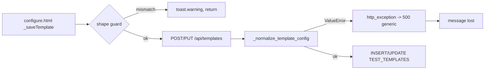

MODE: PLAN

## Rules Loaded
- [/Users/rgoldin/Programming/ai_coding_rules/rules/000-global-core.md](/Users/rgoldin/Programming/ai_coding_rules/rules/000-global-core.md) (foundation)
- [/Users/rgoldin/Programming/FlakeBench/PROJECT.md](/Users/rgoldin/Programming/FlakeBench/PROJECT.md) (project context: subagent usage, file size limits, modularization patterns)
- To load at ACT: `200-python-core.md` (.py), `206-python-pytest.md` (keyword: test), `800-project-changelog.md` (keyword: changelog)
- No rule matched keywords "arity", "bind variable", or "sql shape"; foundation plus Python domain apply.

---

# Context

## What happened

A run against `UNISTORE_BENCHMARK.PUBLIC.TPCH_SF100_ORDERS_INT` failed every
POINT_LOOKUP query during warmup with `002049 (42601): Bind variable ? not set.`
The template's point-lookup SQL was a range query with three placeholders:

```sql
WHERE "O_ORDERDATE" = ? AND "O_CUSTKEY" BETWEEN ? AND ? + 2399
```

## Why it got that far

Two independent gaps let bad SQL reach the executor.

**Save-time validation only checks presence, never shape.**
[backend/api/routes/templates_modules/config_normalizer.py:150-158](backend/api/routes/templates_modules/config_normalizer.py) requires SQL to be non-empty when its weight is above zero, and nothing more:

```python
for pct_k, sql_k in required_pairs:
    if float(out.get(pct_k) or 0.0) > 0 and not str(out.get(sql_k) or "").strip():
        raise ValueError(f"{sql_k} is required when {pct_k} > 0")
```

**The executor has a fixed arity per kind and no validation.**
[backend/core/test_executor.py:3999-4001](backend/core/test_executor.py) hardcodes one bind for POINT_LOOKUP with no placeholder count at all, and RANGE_SCAN at `:4004-4046` counts placeholders but its `else` branch hardcodes two. Both are correct for their intended shapes; neither rejects anything.

Per your direction, the executor's fixed shapes stay. Validation moves to save time.

## Expected shapes (the contract being enforced)

| Kind | Placeholders | Predicate |
|---|---|---|
| POINT_LOOKUP | exactly 1 | equality bound to the placeholder, no range operator |
| RANGE_SCAN | 1 or 2 | at least one range operator (`BETWEEN`, `>`, `>=`, `<`, `<=`) |

RANGE_SCAN allows 1 because [test_executor.py:4006-4040](backend/core/test_executor.py) has a legitimate single-param time-cutoff path.

All four shipped defaults pass ([templates_modules/constants.py:38-55](backend/api/routes/templates_modules/constants.py)) — Snowflake `WHERE id = ?` and `WHERE id BETWEEN ? AND ? + 100`, Postgres `$1` / `$1 AND $2`. No default needs changing.

## Existing patterns to follow

**Client-side hard block** — guard clause, warning toast, bare `return` before `isSaving`. [configure.html:3089-3095](backend/templates/pages/configure.html):

```javascript
const total = this.mixTotal();
if (Math.abs(total - 100) > 0.001) {
    window.toast.warning(`Mix percentages must sum to 100.00 (currently ${total.toFixed(2)}).`);
    return;
}
```

The pct/query pairing guard immediately below at `:3097-3111` carries the comment `// Match server validation:` — duplicating server rules in JS is the established convention here, so this plan follows it rather than adding a validation endpoint.

**Structured 400 on save** — [templates.py:1765-1776](backend/api/routes/templates.py) (`_check_pgbouncer_requirements`) raises `HTTPException(400, detail={"error": ..., "message": ..., "docs_url": ...})`, and [configure.html:3518-3525](backend/templates/pages/configure.html) already extracts `detail.message`. Reuse both ends.

## Blocking defect found while exploring

Server-side validation messages currently never reach the user.
`_normalize_template_config` raises `ValueError`; both save paths catch bare
`Exception` and route through `http_exception`
([backend/api/error_handling.py:74](backend/api/error_handling.py)), which has no
`ValueError` branch and falls through to a 500 at `:115-118`. The user sees
`"create template failed."`

Worse, [templates.py:1899](backend/api/routes/templates.py) `create_template`
lacks the `except HTTPException: raise` guard that
`_update_template_internal` has at `:1985-1986`, so even a deliberate 400 gets
re-wrapped as a 500 on create. The existing pgbouncer 400 is already broken on
that path.

This must be fixed or the server half of this feature is invisible. It also
un-swallows the existing weights-must-sum-to-100 message.



# Implementation steps

### 1. Add a shared SQL shape validator (Python)

New module `backend/api/routes/templates_modules/sql_shape.py`.
PROJECT.md requires a new module rather than growing an existing file;
`config_normalizer.py` stays slim and this logic is independently testable.

Two public functions:

- `count_placeholders(sql) -> int` — normalize first, then count `?`; if zero, count `$N` matches. Mirrors [test_executor.py:3604-3609](backend/core/test_executor.py) but adds normalization.
- `validate_query_shape(kind, sql) -> str | None` — returns an error message or `None`.

Normalization before any inspection: strip `--` line comments, `/* */` block
comments, and single-quoted string literals (honoring `''` escapes). Without
this, a literal containing `?` inflates the count and a `--` comment mentioning
`BETWEEN` triggers a false block. Double-quoted identifiers are left intact;
they are harmless to the regexes and stripping them would be extra risk.

Detection regexes over the normalized, uppercased SQL:
- range operator: `\bBETWEEN\b` or `(>=|<=|>|<)\s*(\?|\$\d+)`
- placeholder equality: `(?<![<>!])=\s*(\?|\$\d+)` — the lookbehind is required or `>=` and `<=` both match as equality

Messages name the offending construct and point at the right field:

- `Point Lookup requires exactly 1 bind placeholder; found 3. This looks like a Range Scan — use the Range Scan query instead, or switch to a Generic SQL query for arbitrary shapes.`
- `Point Lookup must not use a range predicate (found BETWEEN). ...`
- `Point Lookup requires an equality predicate bound to a placeholder (e.g. WHERE col = ?).`
- `Range Scan requires 1 or 2 bind placeholders; found 3.`
- `Range Scan requires a range predicate (BETWEEN, >, >=, <, <=). This looks like a Point Lookup — use the Point Lookup query instead.`

The Generic SQL pointer matters: it is the only kind that accepts arbitrary
placeholder counts with typed per-placeholder specs
([test_executor.py:3766-3970](backend/core/test_executor.py)), so it is the real
escape hatch for a clustering-aligned multi-predicate query.

Deliberately **not** enforced: that `BETWEEN` implies exactly 2 placeholders.
`BETWEEN ? AND '1998-01-01'` is a valid 1-placeholder range scan.

### 2. Wire it into server-side save validation

In [config_normalizer.py](backend/api/routes/templates_modules/config_normalizer.py), extend the existing `required_pairs` loop at `:150-158` to also call `validate_query_shape` — gated on `pct > 0`, matching the presence rule. A leftover default in an unused, zero-weight field must not block a save.

Only POINT_LOOKUP and RANGE_SCAN are validated. INSERT and UPDATE keep their current behavior (they already honor `_count_placeholders` at [test_executor.py:4049](backend/core/test_executor.py) and `:4131`), and GENERIC_SQL has its own arity check at `:3792-3796`.

### 3. Make server validation messages actually reach the client

Two surgical fixes in [templates.py](backend/api/routes/templates.py):

- Add `except ValueError as e: raise HTTPException(400, detail={"error": "invalid_config", "message": str(e)})` ahead of the bare `except Exception` in both `create_template` (`:1899`) and `_update_template_internal` (`:1987`).
- Add the missing `except HTTPException: raise` guard to `create_template`, matching `:1985-1986`.

Client-side extraction at [configure.html:3525](backend/templates/pages/configure.html) already reads `detail.message`, so no client change is needed for display.

### 4. Add the client-side hard block

In `_saveTemplate` ([configure.html:3074](backend/templates/pages/configure.html)), add a guard immediately after the existing `requiredPairs` loop at `:3097-3111`, following that block's `// Match server validation:` convention. Port `countPlaceholders` and `validateQueryShape` as local JS helpers with the identical normalization and regexes, and emit the same messages via `window.toast.warning(...)` then `return`.

Drift between the two implementations is the main risk here. Mitigation is a single shared fixture (step 6) rather than two hand-maintained case lists.

### 5. Surface the constraint in the UI before save

The two textareas at [configure.html:658](backend/templates/pages/configure.html) and `:687` give no hint of the expected shape. Add a short static helper line under each ("Exactly one `?`, equality predicate" / "One or two `?`, range predicate") plus a live placeholder count, following the live-total pattern at `:617-621`. Also update the now-inaccurate hint at `:1391`.

### 6. Tests

Shared fixture `tests/fixtures/query_shape_cases.json` — a list of `{kind, sql, valid, reason}` objects consumed by the pytest suite, so both implementations are checked against one list.

Python unit tests (`task test:unit`, mocked and fast):
- All four shipped defaults, both backends, pass
- The reported failing SQL is rejected with the placeholder-count message
- A point lookup with `>= ?` is rejected as a range predicate
- A range scan with only `= ?` is rejected as a point lookup
- `BETWEEN ? AND '1998-01-01'` (1 placeholder) is accepted
- Comment and string-literal normalization: `-- BETWEEN` and `WHERE s = 'a?b' AND k = ?` behave correctly
- Zero-weight fields with mismatched SQL do not raise
- `create_template` and `update_template` return 400 with the message, not 500

### 7. Audit existing saved templates (read-only)

The hard block applies on edit, so any already-saved template with mismatched SQL will refuse to save until corrected — including the one from the failed run. Before shipping, run a read-only query over `TEST_TEMPLATES` ([templates.py:1871](backend/api/routes/templates.py)) to list affected templates so they can be fixed deliberately rather than discovered one at a time. No preflight check is in scope, per your direction.

### 8. Validate and record

`Taskfile.yml` exposes no `validate` or `lint` task, so per the AGENTS.md tool-discovery order fall through to the domain rule commands. The project uses uv (`uv.lock` present): `task test:unit`, plus `uvx ruff check`, `uvx ruff format --check`, `uvx ty check` on touched files.

Then log the QA issues (next ID is 007 per [docs/ISSUES_INDEX.md](docs/ISSUES_INDEX.md)):

| ID | Severity | Component | Title |
|---|---|---|---|
| ISSUE-007 | High | `config_normalizer.py` | Template save accepts SQL whose shape does not match its query kind |
| ISSUE-008 | High | `templates.py` / `error_handling.py` | Config ValueError surfaces as generic 500, losing the validation message |
| ISSUE-009 | Medium | `templates.py:1899` | create_template lacks HTTPException guard, re-wrapping deliberate 400s as 500 |

Cross-reference open **ISSUE-005** in ISSUE-007's Evidence: the underlying SQL
compilation error was reported as `Network error during query execution`, which
slowed triage. Not fixed here.

Then update `docs/ISSUES_INDEX.md`, run the plan-qa Step 8 validation (re-read
both files, verify field completeness, ID uniqueness across all issue files,
index cross-reference, line counts — `ISSUES.md` is 117 lines so no rotation),
update `CHANGELOG.md`, and write the regression checks to
`/memories/projects/Users-rgoldin-Programming-FlakeBench/regression-checklist.md`.

# Verification

- `task test:unit` — all new cases pass, no existing test regresses
- `uvx ruff check`, `uvx ruff format --check`, `uvx ty check` on touched files
- Browser check (PROJECT.md: automated tests passing does not mean the UI works):
  paste the failing point-lookup SQL into the Point Lookup field with weight
  above zero, confirm save is blocked with the placeholder-count message;
  correct it to `WHERE "O_ORDERKEY" = ?` and confirm save succeeds
- Bypass check: `curl` a PUT with the mismatched config directly and confirm a
  400 with the specific message, not a 500
- Regression: confirm the weights-must-sum-to-100 error now shows its real
  message instead of "create template failed."
- Round-trip: save a valid template, reload the configure page, confirm both SQL
  fields and weights are unchanged

# Critical Files

- [backend/api/routes/templates_modules/sql_shape.py](backend/api/routes/templates_modules/sql_shape.py) - New module; canonical shape validator and placeholder counter
- [backend/api/routes/templates_modules/config_normalizer.py](backend/api/routes/templates_modules/config_normalizer.py) - Server-side enforcement point, next to the existing pct/query pairing rule at lines 150-158
- [backend/api/routes/templates.py](backend/api/routes/templates.py) - Both save paths; needs the ValueError-to-400 branch and the missing HTTPException guard
- [backend/templates/pages/configure.html](backend/templates/pages/configure.html) - Client-side guard in `_saveTemplate` (~line 3097) plus field hints at 658/687
- [backend/core/test_executor.py](backend/core/test_executor.py) - Read-only reference for the arity contract being enforced (lines 3999-4046, 3604-3609)

# Out of scope

- **Changing executor behavior.** POINT_LOOKUP stays at arity 1, RANGE_SCAN at 1-2. Per your direction these kinds remain distinct from GENERIC_SQL.
- **Preflight validation.** You chose client plus server only, so pre-existing saved templates are handled by the step 7 audit rather than a runtime gate.
- **ISSUE-005** (`snowflake_pool.py` reporting SQL errors as network errors). Related and it degraded triage, but separate.
- **Interactive vs. hybrid clustering mismatch.** `TPCH_SF100_ORDERS_INT` clusters on `(O_ORDERDATE, O_CUSTKEY)` while `TPCH_SF100_ORDERS_HYBRID` keys on `O_ORDERKEY`, so no single template is optimal for both and query-for-query comparison between them stays invalid. A benchmark-design decision, not a validation bug.

---

Authorization (required): Reply with `ACT` (or `ACT on items 1-4`).
