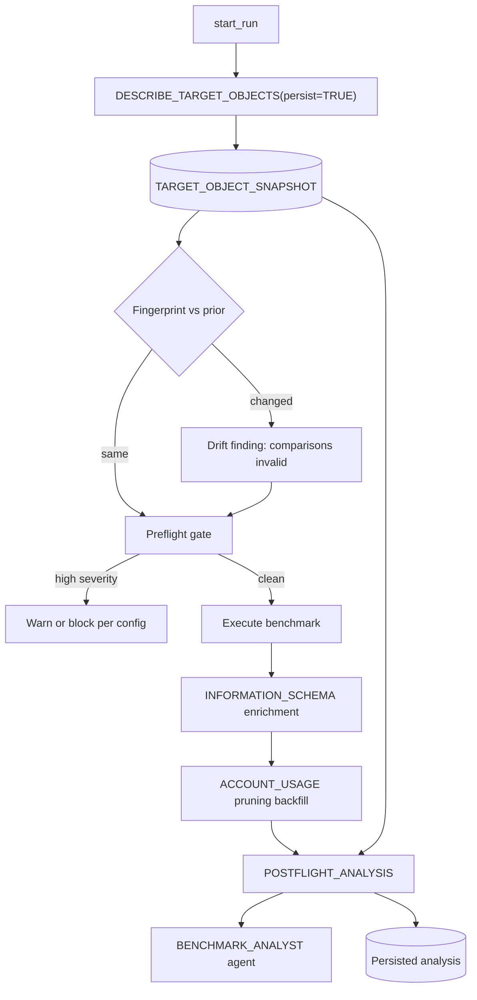

## Context

Explored the run path, the post-run analysis path, and the existing (undeployed) agent infrastructure.

### Q1: Does the benchmark try to achieve optimal performance? No.

Predicate column selection is a **pure name heuristic that never consults the clustering key**. [backend/core/table_profiler.py](backend/core/table_profiler.py):239-281 picks `id_column` by matching names ending in `_ID`/`_KEY` with a distinctness tiebreak (>= 0.98) — which is why `O_ORDERKEY` was chosen on TPC-H ORDERS. [backend/api/routes/templates.py](backend/api/routes/templates.py):1211-1242 then generates `WHERE "O_ORDERKEY" = ?`.

The cluster key is consulted only *afterward*, to warn — and the warning is discarded:

```python
# templates.py:1247-1250
if is_interactive and cluster_by_columns:
    if key_col and key_col.upper() not in cluster_by_columns:
        interactive_warnings.append(...)
# templates.py:1448-1451  -> toast only, never persisted
toast_level="warning" if interactive_warnings else toast_level,
```

Two further holes: the check requires `cluster_by_columns` from `SHOW INTERACTIVE TABLES` ([table_managers/interactive.py](backend/core/table_managers/interactive.py):80-85), so a **standard table on an interactive warehouse (zero-copy) is never checked**; and `validate_schema` logs a missing-clustering-key warning then `return True` ([interactive.py](backend/core/table_managers/interactive.py):127-150).

A real 583-line preflight module with 8 checks exists ([backend/core/orchestrator_modules/preflight.py](backend/core/orchestrator_modules/preflight.py)), including `_check_missing_clustering_key` (:468-507) and `_check_zero_copy_opportunity` (:357-409) — **but nothing on the run path calls it.** Its only caller is `GET /api/runs/{run_id}/preflight` ([backend/api/routes/runs.py](backend/api/routes/runs.py):189-205); `start_run` ([backend/core/orchestrator.py](backend/core/orchestrator.py):711-830) does not. `warm_cache` ([interactive.py](backend/core/table_managers/interactive.py):171-254) has no production callers either.

### Q2: Why the analysis is way off

One `AI_COMPLETE` call ([backend/api/routes/test_results.py](backend/api/routes/test_results.py):8705) fed a hand-built prompt. Four compounding defects:

1. **The decisive metric is structurally absent.** Enrichment reads `INFORMATION_SCHEMA.QUERY_HISTORY` ([backend/core/results_store.py](backend/core/results_store.py):1660-1671), which per its own comment lacks `PARTITIONS_*` and `BYTES_SPILLED_*`. Verified: `ACCOUNT_USAGE.QUERY_HISTORY` has them, and for run `6ce4dd33` reports `partitions_scanned = 261, partitions_total = 261` — 100% scanned, zero pruning.
2. **Prompts ask for judgments the data cannot support** — "Data bound (high bytes scanned)?" ([sql/schema/analysis_procedure.sql](sql/schema/analysis_procedure.sql):252-256) with no pruning or spill input.
3. **No enrichment gate.** `ai_analysis` never checks `enrichment_status` despite a ~45s lag ([test_results.py](backend/api/routes/test_results.py):5690-5691), so grading silently degrades to client latency only.
4. **Non-deterministic and unpersisted.** `temperature: 0.3`, no cache, no analysis table — each reload can yield a different grade for an unchanged run.

### Q3: UDF vs table for DDL access

**A UDF cannot do this.** Per [stored procedures vs UDFs](https://docs.snowflake.com/en/developer-guide/stored-procedures-vs-udfs): "In a UDF, you can use SQL to execute queries only (not DML or DDL statements)" — `SHOW TABLES` is a metadata command. And per [SQL UDF limitations](https://docs.snowflake.com/en/developer-guide/udf/sql/udf-sql-limitations), dynamic SQL referring to database objects fails in a UDF and requires a stored procedure — which is exactly the shape needed (introspect an arbitrary table passed as a parameter). The existing agent specs already bind `generic` tools to stored procedures, so this matches the repo pattern.

**Live read and snapshot are both required, for different reasons.** A live read is *wrong* for post-hoc analysis: if the agent investigates run `6ce4dd33` after the clustering key is fixed, live `SHOW TABLES` reports the current spec and the slow run becomes unexplainable. Resolution: one procedure with a `persist` flag — single introspection code path, so live and recorded field definitions cannot drift.

Verified metadata reachability:

| Signal | Source | Latency |
|---|---|---|
| `CLUSTERING_KEY`, `IS_INTERACTIVE`, `ROW_COUNT`, `BYTES` | `INFORMATION_SCHEMA.TABLES` | none |
| `SEARCH_OPTIMIZATION`, `AUTO_CLUSTERING`, `IS_DYNAMIC` | `SHOW TABLES` + `RESULT_SCAN` only (absent from `ACCOUNT_USAGE.TABLES`) | none |
| `average_depth`, `average_overlaps`, `version` (CLASSIC/OPTIMA) | `SYSTEM$CLUSTERING_INFORMATION` | none |
| warehouse `type`, `generation`, `tables`, fallback | `SHOW WAREHOUSES` + `RESULT_SCAN` | none |
| `PARTITIONS_*`, `BYTES_SPILLED_*` | `ACCOUNT_USAGE.QUERY_HISTORY` | ~10-45 min |

### Q4: Drift detection

Yes, and it is the highest-value capability here: a cross-run comparison is only valid if the physical config was identical. Critical constraint — **fingerprint configuration only, never state.** `ROW_COUNT`, `BYTES`, and clustering depth change on every `TARGET_LAG` refresh, so hashing all fields would flag drift on every run.

- **Config (in fingerprint):** clustering key, search optimization, auto-clustering, table kind, warehouse type/size/generation, fallback warehouse
- **State (recorded, excluded from fingerprint):** row count, bytes, clustering depth/overlaps, partition count

Agent infrastructure is written and **deployed by nothing** — `grep "CREATE AGENT"` returns zero hits in executable code; [backend/setup_schema.py](backend/setup_schema.py):32-38 deploys 7 files, excluding `semantic_view.sql`, `analysis_procedure.sql`, `statistical_procedures.sql`, `chart_procedures.sql`. Three defects: `cortex_agent.json` has empty `warehouse` strings; `benchmark_analyst_agent.json` binds `cost_calculator` to the ARRAY `COST_CALCULATOR` that [statistical_procedures.sql](sql/schema/statistical_procedures.sql):601 says agents cannot call (should be `COST_CALCULATOR_V2`); `semantic_view.sql` is truncated mid-statement at line 628.



## Implementation steps

### 1. Add `DESCRIBE_TARGET_OBJECTS` procedure with a persist flag
New `sql/schema/preflight_procedures.sql` containing `DESCRIBE_TARGET_OBJECTS(p_db, p_schema, p_table, p_warehouse, p_test_id, p_persist BOOLEAN)` as a **stored procedure** (`EXECUTE AS OWNER`), returning VARIANT and optionally writing a snapshot row. Combines `INFORMATION_SCHEMA.TABLES`, `SHOW TABLES` + `RESULT_SCAN`, `SYSTEM$CLUSTERING_INFORMATION`, and `SHOW WAREHOUSES` + `RESULT_SCAN`, following the `RESULT_SCAN(LAST_QUERY_ID())` pattern at [statistical_procedures.sql](sql/schema/statistical_procedures.sql):557-581. Use colon-prefixed `:param` bindings per project convention. One code path serves live preflight, ad-hoc agent queries, and the persisted run record.

### 2. Add `TARGET_OBJECT_SNAPSHOT` table with a config fingerprint
In [sql/schema/results_tables.sql](sql/schema/results_tables.sql), add `CREATE OR ALTER TABLE TARGET_OBJECT_SNAPSHOT` keyed on `TEST_ID`/`RUN_ID`, with config columns, state columns, `PREDICATE_COLUMNS VARIANT`, `SPEC_FINGERPRINT` (hash over config fields only), and `SNAPSHOT_AT`. Document the config/state split inline so the fingerprint is not accidentally widened later.

### 3. Capture the snapshot on the run path
In [backend/core/orchestrator.py](backend/core/orchestrator.py), call `DESCRIBE_TARGET_OBJECTS(..., p_persist => TRUE)` inside `start_run` (~:711) before worker spawn, reusing `_pre_validate_tables` (~:1095) for target resolution. Parse predicate columns from `SCENARIO_CONFIG.workload.custom_queries[].sql` (the shapes produced at [templates.py](backend/api/routes/templates.py):1211-1242). Snapshot failure must warn, not abort.

### 4. Add drift detection against the prior snapshot
Compare `SPEC_FINGERPRINT` to the most recent snapshot for the same table + warehouse. On mismatch, emit a finding naming which config fields changed, and mark affected cross-run comparisons as invalid so the dashboard cannot silently attribute a config change to the variable under test. Surface state deltas (row count, bytes, clustering depth) informationally without triggering drift.

### 5. Add clustering, Optima, and SOS preflight checks
In [backend/core/orchestrator_modules/preflight.py](backend/core/orchestrator_modules/preflight.py), add checks reading the snapshot rather than `SHOW INTERACTIVE TABLES`, so zero-copy is covered:
- `_check_predicate_vs_clustering` — severity `high` when no predicate column appears in `CLUSTERING_KEY`; report expected full-scan bytes.
- `_check_search_optimization` — off-key high-cardinality equality predicate with `SEARCH_OPTIMIZATION = OFF` recommends `ADD SEARCH OPTIMIZATION ON EQUALITY(col)`.
- `_check_optima_eligibility` — Optima Indexing/Metadata/Planning require Gen2 standard or Adaptive warehouses; flag `WH_TYPE = INTERACTIVE` as ineligible, and `CLUSTERING_VERSION = CLASSIC` as non-migratable, so no one waits for automatic rescue.
Register in the aggregator at :573-582.

### 6. Wire preflight into `start_run` and persist warnings
Invoke `get_preflight_warnings` ([orchestrator.py](backend/core/orchestrator.py):364) from `start_run`, persist findings to the run record, and show them on the history page. Change [templates.py](backend/api/routes/templates.py):1448-1451 to persist `interactive_warnings` with the template instead of toast-only. Default to warn-and-record with a config flag to hard-block on `high` severity — a benchmark tool must still be able to deliberately measure a bad configuration.

### 7. Add ACCOUNT_USAGE second-pass enrichment
In [backend/core/results_store.py](backend/core/results_store.py), add a pass after `enrich_query_executions_from_query_history` (:1579) that MERGEs `PARTITIONS_SCANNED`, `PARTITIONS_TOTAL`, `BYTES_SPILLED_TO_LOCAL_STORAGE`, `BYTES_SPILLED_TO_REMOTE_STORAGE` from `ACCOUNT_USAGE.QUERY_HISTORY` on `QUERY_ID`. Add `SF_PARTITIONS_*` / `SF_BYTES_SPILLED_*` columns to `QUERY_EXECUTIONS` plus derived `PRUNING_RATIO`. Track a distinct `enrichment_stage` since this pass lags the first.

### 8. Gate, cache, and persist the analysis
In [backend/api/routes/test_results.py](backend/api/routes/test_results.py): gate `ai_analysis` (:8009) on `get_test_enrichment_status` (:6436), returning an explicit pending state instead of degrading silently; set `temperature: 0` at :8705; add an `AI_ANALYSIS_CACHE` table so a run has one stable verdict. Inject pruning ratio and spill into the prompt builders (:6794, :7075, :7346), and make unavailable metrics read "not measured" rather than `N/A`.

### 9. Add `PREFLIGHT_ANALYSIS` / `POSTFLIGHT_ANALYSIS` procedures
In `sql/schema/preflight_procedures.sql`, two `RETURNS VARIANT` procedures over the snapshot plus pruning data, mirroring the `GET_QUICK_SUMMARY` shape ([analysis_procedure.sql](sql/schema/analysis_procedure.sql):493). Deterministic core shared by the app gate and the agent tools, so both reason from one source of truth.

### 10. Fix and deploy the agent
Repair the three defects: fill `execution_environment.warehouse` in [sql/schema/cortex_agent.json](sql/schema/cortex_agent.json):174-246; repoint `cost_calculator` to `COST_CALCULATOR_V2` in [sql/schema/benchmark_analyst_agent.json](sql/schema/benchmark_analyst_agent.json):49-69; complete the truncated statement in [sql/schema/semantic_view.sql](sql/schema/semantic_view.sql):628. Add `TARGET_OBJECT_SNAPSHOT` as a semantic-view table with dimensions (`CLUSTERING_KEY`, `SEARCH_OPTIMIZATION`, `WH_TYPE`, `CLUSTERING_VERSION`, `SPEC_FINGERPRINT`) and a `SNAPSHOT_TO_TEST` relationship, plus the dimensions missing from the CA extension (:381-393). Register `describe_target_objects`, `preflight_analysis`, `postflight_analysis` tools. Extend [backend/setup_schema.py](backend/setup_schema.py):32-38 to deploy the four undeployed SQL files plus the new one, and add a `CREATE AGENT` step. Pick one agent spec and delete the other to stop the drift.

## Verification

1. **Procedure correctness** — call `DESCRIBE_TARGET_OBJECTS` on `UNISTORE_BENCHMARK.PUBLIC.TPCH_SF100_ORDERS_INT` with `p_persist => FALSE` and assert `CLUSTERING_KEY = 'LINEAR(O_ORDERDATE, O_CUSTKEY)'`, `SEARCH_OPTIMIZATION = OFF`, `CLUSTERING_VERSION = CLASSIC`, `WH_TYPE = INTERACTIVE`.
2. **Fingerprint stability** — call twice with no config change and assert an identical `SPEC_FINGERPRINT` despite `ROW_COUNT`/`BYTES` movement on the dynamic table. This is the test that catches a wrongly-widened fingerprint.
3. **Drift detection** — snapshot, then enable search optimization in a scratch copy, re-snapshot, and assert a drift finding naming `SEARCH_OPTIMIZATION` and comparison invalidation.
4. **Preflight regression** — the `6ce4dd33` config must now emit a `high` finding naming `O_ORDERKEY` vs the cluster key, plus SOS and Optima-ineligibility findings. This is the test that run would have failed.
5. **Backfill against known truth** — re-enrich `6ce4dd33` and assert `partitions_scanned = 261`, `partitions_total = 261`, `pruning_ratio = 1.0`, matching the verified ACCOUNT_USAGE reading.
6. **Determinism** — call `ai-analysis` three times on one run; assert byte-identical output and exactly one `AI_COMPLETE` in `QUERY_HISTORY`.
7. **Enrichment gate** — request analysis immediately post-run; assert a pending response, not a client-latency-only grade.
8. **Retrospective correctness** — snapshot a run, change the clustering key, then ask the agent about the original run; assert it reasons from the snapshot (reporting the original key) and not live DDL.
9. **Agent smoke test** — ask "why was run 6ce4dd33 slow?" and confirm it calls `postflight_analysis`, cites 261/261 pruning, and recommends clustering/SOS over generic advice.
10. **Existing suites** — `tests/test_interactive_analytics.py` already exercises `warm_cache` and `check_warehouse_attachment`; run the full suite via the project Taskfile.

## Critical Files

- [backend/core/orchestrator_modules/preflight.py](backend/core/orchestrator_modules/preflight.py) - 8 existing checks to extend; currently unreachable from the run path
- [backend/core/orchestrator.py](backend/core/orchestrator.py) - `start_run` at :711 must call describe + drift + preflight gate
- [backend/core/results_store.py](backend/core/results_store.py) - enrichment at :1579-1671; add the ACCOUNT_USAGE pruning pass
- [backend/api/routes/test_results.py](backend/api/routes/test_results.py) - `ai_analysis` at :8009 and prompt builders at :6794+ need gating, determinism, pruning input
- [sql/schema/semantic_view.sql](sql/schema/semantic_view.sql) - truncated at :628; must expose the snapshot for agent text-to-SQL
