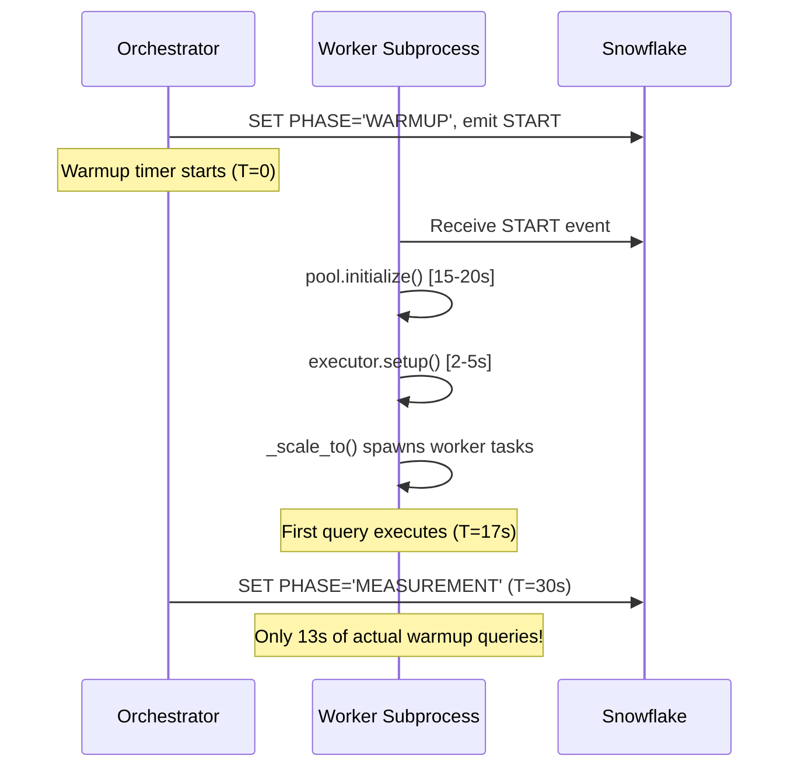
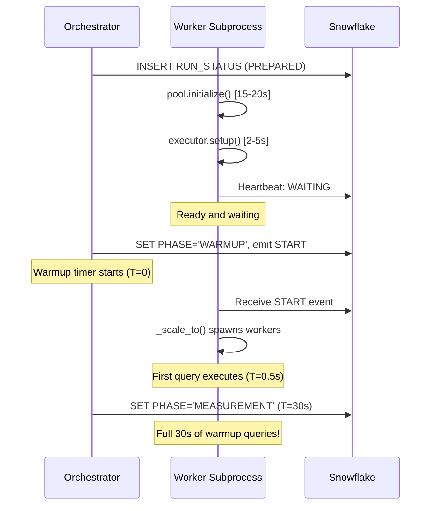

# Plan: Fix Warmup Phase Worker Readiness

## Problem Statement

The warmup phase is intended to "prime" Snowflake compute (warehouse clusters, caches) and workers so that measurement begins with everything ready. However, **workers spend the first 15-20 seconds of warmup initializing infrastructure** rather than executing queries.

### Current Timeline (Broken)



### Two Connection Pools (Clarification)

The system uses **two separate Snowflake connection pools**:

| Pool | Location | Purpose | When Initialized |
|------|----------|---------|------------------|
| **Results Store Pool** | `backend/core/results_store.py` | Control plane: heartbeats, metrics snapshots, event polling | App startup (already warm) |
| **Benchmark Pool** | `run_worker.py:548-570` | Data plane: executing benchmark queries | After START event (line 768) |

The Results Store pool is **already initialized** when the worker starts. The problem is the **Benchmark Pool** initialization happens AFTER the warmup timer begins.

### Root Cause

In [scripts/run_worker.py](scripts/run_worker.py):

```python
# Line 718: Wait for START event (warmup timer already running in orchestrator)
if not await _wait_for_start(timeout_seconds=120):
    ...

# Line 726: Report "RUNNING" (misleading - not actually ready)
await _safe_heartbeat("RUNNING")

# Line 768: NOW initialize benchmark pool (15-20s)
await pool_override.initialize()

# Line 782: Setup tables (2-5s)
ok = await executor.setup()

# Line 859: Finally spawn workers and execute queries
await _scale_to(current_target, warmup=(current_phase == "WARMUP"))
```

---

## Three Proposed Solutions

### Plan A: Pre-Warmup Gate (Add INITIALIZING Phase)

**Concept**: Add a new phase where workers initialize BEFORE warmup timing begins.


**Implementation**:

1. **Orchestrator changes** ([backend/core/orchestrator.py](backend/core/orchestrator.py)):
   - After emitting START, set `PHASE='INITIALIZING'`
   - Wait for all workers to report `STATUS='READY'` in `WORKER_HEARTBEATS`
   - Only then transition to `PHASE='WARMUP'` and start warmup timer

2. **Worker changes** ([scripts/run_worker.py](scripts/run_worker.py)):
   - On START: report `STATUS='INITIALIZING'`
   - Initialize benchmark pool + setup
   - Report `STATUS='READY'`
   - Wait for `PHASE='WARMUP'` event before spawning workers

3. **Schema changes**:
   - Add `INITIALIZING` to PHASE enum in RUN_STATUS
   - Add `READY` status to WORKER_HEARTBEATS.STATUS

**Pros**:
- Clean separation of concerns
- Warmup timer reflects actual query execution time
- Dashboard can show "Initializing workers..." before warmup
- Robust: Orchestrator knows all workers are ready before timing begins

**Cons**:
- Most complex implementation (schema changes, new phase logic)
- Adds ~1-2s latency for orchestrator to detect all workers ready
- Requires UI changes to display new phase
- Risk of timeout if worker init fails (need fallback logic)

---

### Plan B: Initialization-First Ordering (Move Init Before START Wait)

**Concept**: Initialize the benchmark pool BEFORE waiting for the START event, while the run is still PREPARED.

**Current flow**:
```
Worker starts → Wait for START → Initialize pool → Setup → Execute
```

**Proposed flow**:
```
Worker starts → Initialize pool → Setup → Wait for START → Execute immediately
```

**Implementation**:

1. **Worker changes only** ([scripts/run_worker.py](scripts/run_worker.py)):

Move pool initialization (lines 764-780) to BEFORE `_wait_for_start()` (line 718):

```python
# BEFORE (current - broken)
if not await _wait_for_start(timeout_seconds=120):
    ...
await _safe_heartbeat("RUNNING")
await pool_override.initialize()  # 15-20s AFTER warmup starts
ok = await executor.setup()       # 2-5s more

# AFTER (proposed - fixed)
await pool_override.initialize()  # Initialize while PREPARED
ok = await executor.setup()       # Setup while PREPARED
if not await _wait_for_start(timeout_seconds=120):
    ...
await _safe_heartbeat("RUNNING")
# Workers immediately ready to execute on START
```

2. **Heartbeat status update**:
   - Report `STATUS='INITIALIZING'` during pool init
   - Report `STATUS='WAITING'` after init, while waiting for START
   - Report `STATUS='RUNNING'` after START received

**Pros**:
- Minimal changes (worker-side only, ~20 lines of code)
- No schema changes required
- No orchestrator changes required
- Workers are genuinely ready when START arrives

**Cons**:
- Pool initialized even if START never comes (wasted connections if run cancelled)
- If pool init fails, worker exits before START (harder to debug)
- Slightly longer time from "Prepare" to "Start available" in UI
- Workers hold connections during PREPARED phase (minor resource waste)

---

### Plan C: Split Warmup (Declared Initialization Time)

**Concept**: Keep warmup timing as-is, but subtract initialization time from reported warmup duration. Document that the first N seconds are "infrastructure warmup."

**Implementation**:

1. **Worker changes** ([scripts/run_worker.py](scripts/run_worker.py)):
   - Track `init_start_time` before pool init
   - Track `init_end_time` after setup complete
   - Include `initialization_seconds` in metrics snapshots

2. **Orchestrator changes** ([backend/core/orchestrator.py](backend/core/orchestrator.py)):
   - Track max `initialization_seconds` across workers
   - Extend warmup duration by `max(initialization_seconds)` OR
   - Only count "effective warmup" = total_warmup - initialization

3. **Results changes**:
   - Add `INITIALIZATION_SECONDS` column to TEST_RESULTS
   - Display "Effective warmup: 15s (30s total - 15s init)" in UI

**Pros**:
- No behavioral changes (least risky)
- Better visibility into what warmup time is spent on
- Can inform users to increase warmup_seconds based on init time

**Cons**:
- Doesn't actually fix the problem (warmup still not priming Snowflake fully)
- Adds complexity without improving benchmark quality
- "Effective warmup" concept is confusing to users
- init time varies by concurrency (more workers = longer pool init)

---

## Recommendation: Plan B (Initialization-First Ordering)

Plan B is recommended because:

1. **Minimal risk**: Changes are isolated to worker startup sequence
2. **No schema changes**: No DDL, no migration concerns
3. **Correct semantics**: Workers are genuinely ready when warmup begins
4. **Simple implementation**: ~20 lines of code moved/modified

The main downside (pool initialized during PREPARED) is acceptable because:
- Runs typically start within seconds of preparation
- Connection pooling means unused connections are recycled
- If users cancel during PREPARED, connections are cleaned up on worker exit

---

## Implementation Details (Plan B)

### File: [scripts/run_worker.py](scripts/run_worker.py)

**Step 1**: Move pool initialization before START wait (lines 764-792 → before line 718)

```python
# Current location: after line 726 (after START received)
# New location: before line 718 (before waiting for START)

# === Move this block BEFORE _wait_for_start ===
if not is_postgres:
    try:
        pool_override = getattr(executor, "_snowflake_pool_override", None)
        if pool_override is not None:
            await _safe_heartbeat("INITIALIZING")  # New status
            await pool_override.initialize()
            health.record_success()
    except Exception as exc:
        logger.error("Benchmark pool initialization failed: %s", exc)
        last_error = str(exc)
        await _safe_heartbeat("DEAD")
        # ... error handling ...
        return 2

ok = await executor.setup()
if not ok:
    # ... error handling ...
    return 1

await _safe_heartbeat("WAITING")  # Ready, waiting for START
# === End moved block ===

if not await _wait_for_start(timeout_seconds=120):
    ...

await _safe_heartbeat("RUNNING")
# Now workers can immediately execute
```

**Step 2**: Update heartbeat states in worker lifecycle

| Phase | Current Status | New Status |
|-------|----------------|------------|
| Pool initializing | (not reported) | `INITIALIZING` |
| Setup complete, waiting | `WAITING` | `WAITING` (unchanged) |
| START received | `RUNNING` | `RUNNING` (unchanged) |

**Step 3**: Adjust `_scale_to` call timing

Currently (line 859):
```python
await _scale_to(current_target, warmup=(current_phase == "WARMUP"))
```

This should execute immediately after START, which it will since pool is already initialized.

### Expected Timeline After Fix



---

## Validation

After implementation, verify:

1. **Metrics appear earlier**: WebSocket stream should show queries within 1-2s of START
2. **"In flight queries" chart**: Should spike immediately at warmup start
3. **No 15-20s gap**: Between START and first query in QUERY_EXECUTIONS
4. **Pool ready before START**: Worker logs show "Pool initialized" before "START received"

Test command:
```bash
# Run a test with 30s warmup and observe timing
# Check QUERY_EXECUTIONS for first query timestamp vs RUN_STATUS.START_TIME
```
