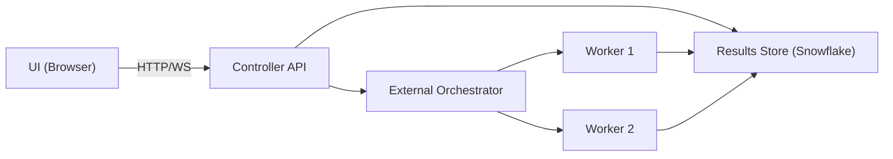

# Architecture Overview (Proposed Multi-Node)

This is a **target** architecture. It does not replace the current system and
intentionally repeats key constraints for clarity.

## Terminology

- **WORKER_ID**: Unique identifier for a worker process (string, e.g., `worker-0`)
- **WORKER_GROUP_ID**: Zero-based index for deterministic sharding (integer)
- **TARGET_CONNECTIONS**: Number of concurrent queries a worker should maintain
- **Warmup**: Run-level phase to prime Snowflake compute (not per-worker)

## System Purpose

Unistore Benchmark runs controlled workloads against existing tables and
persists app-side metrics and query executions to Snowflake. The proposed
multi-node design scales load generation across workers while keeping the
controller responsive and deterministic.

## High-Level Components

- **Controller (FastAPI)**: UI, API, and WebSocket streaming.
- **External Orchestrator (Control Plane)**: owns worker lifecycle and
  run-level state changes.
- **Workers (Data Plane)**: execute benchmark workloads and emit metrics.
- **Results Store (Snowflake `UNISTORE_BENCHMARK.TEST_RESULTS`)**: authoritative
  persistence for run status, snapshots, logs, and executions.
- **Config Store (Snowflake `UNISTORE_BENCHMARK.CONFIG`)**: templates and
  scenario config.
- **Warehouses/Targets**: Snowflake warehouses and optional Postgres targets
  used by the workload.

## Control Plane vs Data Plane

### Control Plane (Orchestrator)
- Creates a parent run and assigns worker groups.
- Starts/stops workers and manages retries.
- Updates authoritative run status and timing in Snowflake.
- Aggregates metrics from worker snapshots into parent rollups.

### Data Plane (Workers)
- Executes workload queries against target systems.
- Emits live metrics snapshots to `WORKER_METRICS_SNAPSHOTS` and logs.
- Persists query executions and per-worker snapshots.
- Workers joining after warmup ends start directly in MEASUREMENT phase.

## Runtime Topology (Local + SPCS)

### Write Path Architecture

To ensure scalability, the write path is split:

1. **Direct Worker Writes (Data Plane)**: Workers write **high-volume** data
   (`WORKER_METRICS_SNAPSHOTS`, `QUERY_EXECUTIONS`) directly to Snowflake. They
   maintain their own connection pools. This prevents the Controller from
   becoming a bottleneck.

2. **Orchestrator Writes (Control Plane)**: The Orchestrator writes **only** to
   Control Tables (`RUN_STATUS`, `RUN_CONTROL_EVENTS`). The Controller initiates
   runs and reads aggregates but does *not* sit in the hot write path of the
   benchmark data.

### Local
- Controller runs as a FastAPI process.
- Orchestrator runs as an **embedded async task** within the controller process
  initially. This avoids operational complexity during early development while
  establishing the right abstractions for later extraction.
- Workers run as subprocesses spawned by the orchestrator.
- Orchestrator retains subprocess handles for SIGTERM fallback on stop.

The orchestrator is implemented as a class (`OrchestratorService`) with a clean
interface that allows extraction to a separate process/service for SPCS.

### Single-Node (N=1)

- Single-node runs follow the **same orchestrator path** as multi-node.
- Orchestrator starts one worker and still creates a parent run.
- UI reads parent state and aggregate metrics (which come from one worker).

### SPCS (Future)
- Controller runs as a long-running SPCS service.
- Orchestrator runs as a separate service (or job controller).
- Workers run as job services or short-lived services per run.

## Control Tables (Hybrid Tables)

> **Requirement**: Hybrid Tables require **Snowflake Enterprise Edition** or higher.
> They are available in AWS and Azure commercial regions only (not GCP or SnowGov).
> Trial accounts do not support Hybrid Tables.

The control-plane state tables use **Snowflake Hybrid Tables** for:

- **Row-level locking**: Concurrent worker heartbeats and orchestrator updates
  do not block each other.
- **ACID transactions**: Phase transitions and stop signals are atomic.
- **Enforced primary keys**: `RUN_ID` uniqueness guaranteed by the database.

Tables:
- `RUN_STATUS`: Per-parent-run lifecycle state (status, phase, timing, worker counts)
- `RUN_CONTROL_EVENTS`: Append-only control messages (STOP, START, SET_PHASE, SET_WORKER_TARGET)
- `WORKER_HEARTBEATS`: Worker liveness and status for control-plane decisions

See `next-data-flow-and-lifecycle.md` for schema details.

## Reiterated Constraints

- No DDL is executed at runtime.
- Schema changes remain in `sql/schema/` and are rerunnable.
- Templates are stored in `UNISTORE_BENCHMARK.CONFIG.TEST_TEMPLATES`.
- Snowflake remains the authoritative results store.
- Control tables (`RUN_STATUS`, `RUN_CONTROL_EVENTS`, `WORKER_HEARTBEATS`) are
  Hybrid Tables.

## Future Enhancement: Cost Tracking

> **TODO**: Implement credit consumption tracking for Hybrid Table operations.
> Hybrid Tables have different pricing than Standard Tables. We should measure
> and report the cost impact of control-plane writes (heartbeats, status updates)
> as part of benchmark run summaries.
